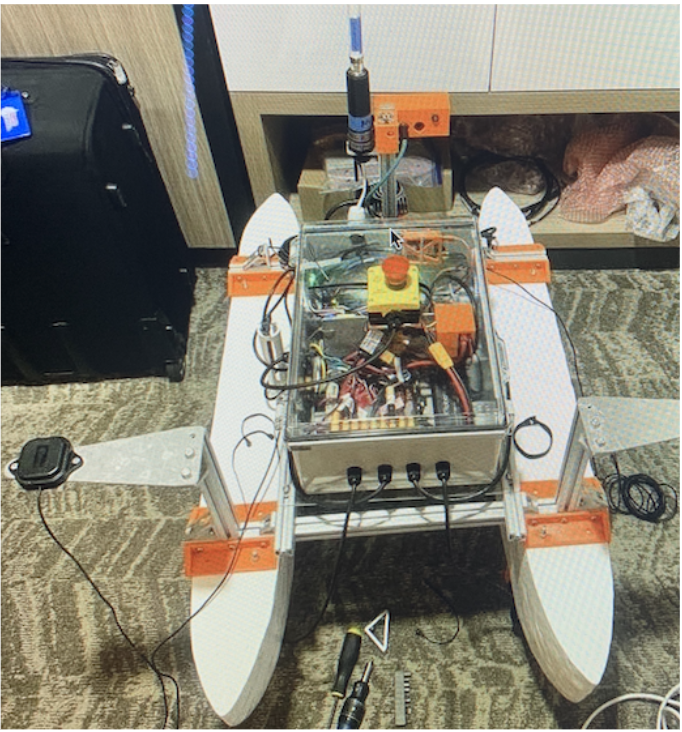
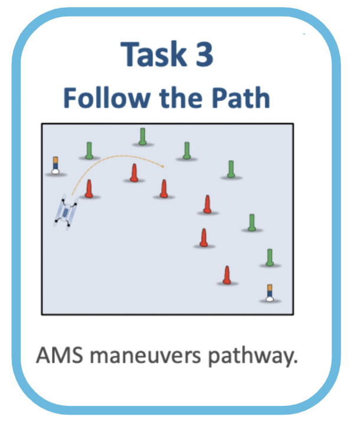

# roboboat_GNC 


## Project Objective and Background

Our project involves collaborating with TritonAI to develop software that enables a
programmable boat, or "roboboat," to navigate through a course marked by buoys. The aim is to
create the system that will guide the boat autonomously by identifying and following a path
created by these buoys without human intervention. This involves integrating sensing
technologies to perceive the environment accurately and implementing deep learning algorithms
to translate the perceived environment into path following navigation commands.



## Contents
- [Setup](#setup)
- [Documentation](#documentation)
- [Contributors](#contributors)
## Methods 

We have trained a Yolov8 model on Roboboat competition images of labeled buoys. We run this model on edge on the Luxonis OAK - D Pro Camera, and generate real-time navigation commands using the following path prediction algorithm:
* polygon from the sorted buoy positions + memory of location
* Midpoint calculations of path in comparison to horizontal center of frame
* Steering commands based on threshold sensitivities for left/right

## Organization
The `navigation` and `perception` folders contain the ROS2 node implementations of detecting bounding boxes from the real-time camera stream and the steering commands to the thusters using our path prediction algorithm. `Yolov8_model` contains the `.blob` file needed to run inference using DepthAI, Luxonis's software library. 


## Yolov8 Model Training
[Yolov8 Model Training](https://colab.research.google.com/drive/162ieDzJ4uWKk8rTw9WhVz0mwlGlbb6D-?usp=sharing)  
[Dataset](https://universe.roboflow.com/cse237d/buoy-detection-dzz7y)

## Custom Model Deployment to Luxonis OAK 
To deploy a custom YOLO model to the Luxonis OAK camera, it must be in the OpenVino .blob format. This process is streamlined at [tools.luxonis.com](https://tools.luxonis.com/), for automatic YOLO export for Luxonis devices. 

## Setup 
Developed and tested on `python=3.8.10`  
Implementation in ROS2 Humble  
Useful Resources for Installation Setup:  
[Docker](https://www.docker.com/products/docker-desktop/)  
[Python](https://www.python.org/)  
[ROS2 Humble](https://docs.ros.org/en/humble/index.html)  


## Docker Container(s) setup 
## Setup for Navigation and Serial Server Docker containers 
Build Docker image for Ros2 Humble and clone the `depthai-python` repository and install requirements. 
```
docker pull osrf/ros:humble-desktop
docker run -it --privileged --network=host osrf/ros:humble-desktop
cd
git clone https://github.com/luxonis/depthai-python.git
cd depthai-python/examples
python3 install_requirements.py
cd ../..
git clone <this repository>
python3 navigation/auto_nav.py
python3 navigation/serial_server.py
```

## Setup for Camera / Perception and Path Prediction Docker Container  
Download and run prebuilt Docker Images for Luxonis ROS Driver, then clone this repository to run perception ROS node. 
```
docker run -it -v /dev/:/dev/  --privileged -e DISPLAY -v /tmp/.X11-unix:/tmp/.X11-unix luxonis/depthai-ros:humble-latest bash
git clone <this repository>
python3 perception/buoy/navigation.py
```

# Instructions to run on Team Inspiration Barco Polo Roboboat (existing)
## Running Docker containers

```bash
docker run --runtime nvidia -it --rm --network=host <container name: tag>
```

View installed packages:

```bash
# need to be inside the docker
apt list
```


Source `ros2` everytime before you're using it.

```bash
source /opt/ros/humble/install/setup.bash
```

## How to ssh to the jetson

1. Connect to the teamInspirationField wifi
2. run: `ssh jetson@192.168.8.202`
3. pw: `jetsonucsd`


## Running the Serial Server
### Serial Server is the code that takes in direction for the oat to move and convert it to thrusters movements
### Code can be found in [/navigation/serial_server.py](https://github.com/a3alani/roboboat_GNC/tree/main/navigation)
1. SSH to the jetson
2. inside the Jetson run
3. run:
```bash
docker run -it --privileged --network=host this_actually_works:latest
```
4. `cd ~/ros2_serial_interface`
5. `. install/setup.bash`
6. `cd ros2_serial_interface`
7. run: `python3 serial_server.py`

## Running the Navigation Node
### Navigation Node is a ROS (Robot Operating System) Node that subscribes to the Camera Node. It subscribes directions for the boat to move and pass the data to the serial server.
### Code can be found in [/navigation/auto_nav.py](https://github.com/a3alani/roboboat_GNC/tree/main/navigation)
1. open a new terminal
2. SSH into the Jetson
3. run `docker ps` and copy the container id of the `this_actually_works` docker container
4. run:
```bash
docker exec -it <container-id> /bin/bash
```
7. `cd ~/ros2_serial_interface`
8. `. install/setup.bash`
9. `cd ros2_serial_interface`
10. `vim auto_nav.py`
11. paste the code into auto_nav.py
12. run: `python3 auto_nav.py`
    
## Running the Camera Node
### Camera Node is a ROS (Robot Operating System) Node that takes in the OAK-D camera input stream, run the model on the input and publish directions for the boat to move. It passes the data to the Navigation Node. 
### Code can be found in [/perception/buoy_navigation.py](https://github.com/a3alani/roboboat_GNC/tree/main/perception)
1. open a new terminal
2. ssh into the Jetson
3. run:
```
docker run -it --privileged --network=host camera_node_working_code
```
5. `cd roboboat_code`
6. run: `python3 buoy_navigation.py`

## Moving the boat
1. Move the boat in front of the buoy path using Remote Controller
2. Press the top left button on the Remote Controller to make it autonomous mode
3. Boat should move autonomously through the buoys, completing the **follow the path** task


## Documentation
- [Project Specification](https://drive.google.com/file/d/1p6h2CfVdSFPlanNX6-uoW_igBA2jE8-6/view?usp=sharing)
- [Milestone Report](https://drive.google.com/file/d/1p6h2CfVdSFPlanNX6-uoW_igBA2jE8-6/view?usp=sharing)
- [Final Oral Presentation](https://docs.google.com/presentation/d/15L_Spe2V0VIPEk-d25XDykG1sU-B2HTUzz7Nw4XxNmM/edit?usp=sharing)
- [Technical Report]()

## Contributors
- [Akshara Kuduvalli](https://github.com/akkuduvalli)
- [Ali Alani](https://github.com/a3alani)
- [Dina Dehaini](https://github.com/dinadehaini)
- [Kenzo Ku](https://github.com/kenzoputraku)
